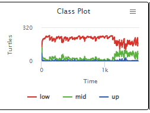
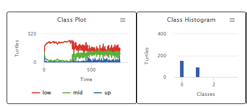
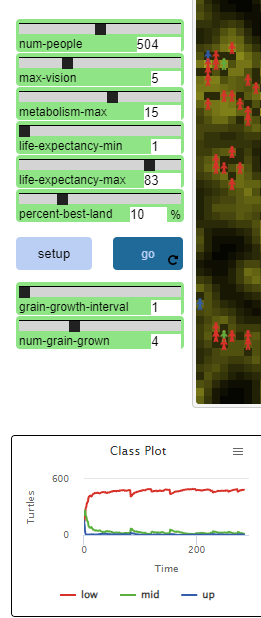
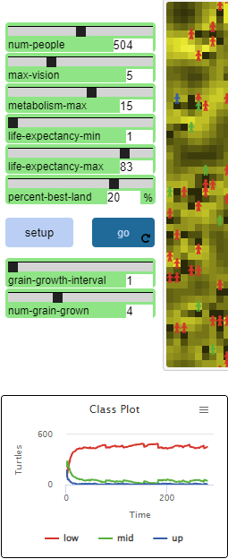
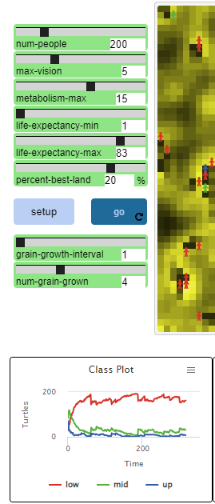
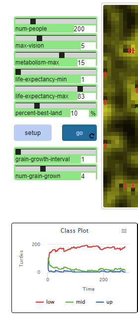

## Імітаційне моделювання комп'ютерних систем
## СПм-21-2, **Кравець Владислав Євгенович**
### Лабораторна робота №**1**. Опис імітаційних моделей та проведення обчислювальних експериментів

 

### Вибрана модель у середовищі NetLogo:
[Wealth Distribution
](http://www.netlogoweb.org/launch#http://www.netlogoweb.org/assets/modelslib/Sample%20Models/Social%20Science/Economics/Wealth%20Distribution.nlogo)

 

### Вербальний опис моделі:
Ця модель імітує розподіл багатства. «Багаті стають багатшими, а бідні біднішими» — відомий вислів, який виражає несправедливість у розподілі багатства. У цьому моделюванні ми бачимо закон Парето, згідно з яким існує велика кількість «бідних» або червоних людей, менше «середнього класу» або зелених людей і набагато менше «багатих» або блакитних людей.

### Як це працює:
Ця модель адаптована з моделі 'Sugarscape' Epstein & Axtell. Замість цукру в ньому використовується зерно. Кожен патч має кількість зерна та ємність зерна (кількість зерна, яку він може виростити). Люди збирають зерно з ділянок і їдять його, щоб вижити. Скільки зерна назбирає кожна людина, таке її багатство.

Модель починається з приблизно рівного розподілу багатства. Потім люди блукають по ландшафту, збираючи якомога більше зерна. Кожна людина намагається рухатися в тому напрямку, де лежить найбільше зерна. Кожен раз, коли відзначається, кожна людина з'їдає певну кількість зерна. Ця кількість називається їх метаболізмом. Люди також мають тривалість життя. Коли закінчується тривалість їхнього життя або закінчується зерно, вони гинуть і дають одне потомство. Потомство має випадковий метаболізм і випадкову кількість зерна, починаючи від кількості зерна найбіднішої людини до кількості зерна найбагатшої людини. (Багатство не успадковується.)

### Керуючі параметри:
Повзунок PERCENT-BEST-LAND визначає початкову щільність ділянок, які висіваються максимальною кількістю зерна. Цей максимум регулюється за допомогою змінної MAX-GRAIN у процедурі SETUP у вікні процедур. Повзунок GRAIN-GROWTH-INTERVAL визначає частоту росту зерна. Повзунок NUM-GRAIN-GROWN визначає, скільки зерна буде вирощено кожного разу, коли GRAIN-GROWTH-INTERVAL дозволяє вирощувати зерно.

Повзунок NUM-PEOPLE визначає початкову кількість людей. LIFE-EXPECTRANY-MIN — це найкоротша кількість років, яку людина може прожити. LIFE-EXPECTANCY-MAX — це найбільша кількість років, яку людина може прожити. Повзунок METABOLISM-MAX встановлює найбільшу можливу кількість зерна, яку людина може з’їсти за такт годинника. Слайдер MAX-VISION - це максимально віддалена відстань, яку може побачити будь-яка людина.

Монітор TIME ELAPSED показує загальну кількість тактів годинника з моменту останнього налаштування. CLASS PLOT показує лінійну графіку кількості людей у ​​кожному класі за певний час. CLASS HISTOGRAM показує ту саму інформацію у формі гістограми. Графік LORENZ CURVE показує криву Лоренца населення в певний час, а також лінію рівності під кутом 45 градусів. Графік GINI-INDEX V. TIME показує індекс Джині на момент малювання кривої Лоренца. Графіки КРИВА ЛОРЕНЦА та GINI-INDEX V. TIME оновлюються кожні 5 проходів через процедуру GO.

 

## Обчислювальні експерименти

### 1. Змініть повзунок NUM-GRAIN-GROWN і подивіться, як це впливає на розподіл багатства.

При зменшенні кількості вирощеного зерна, кількість бідних людей зменшується, а багатих збільшується. При підвищенні багатих стає значно менше.

### 2. Яке значення має LIFE-EXPECTANACY-MAX?

Дивлячись на графік, при низькій тривалості життя, кількість бідних та богатих прирівнюєця.

### 3.Експериментуйте з повзунками PERCENT-BEST-LAND і NUM-PEOPLE. Як вони впливають на результат розподілу багатства?

			

Найбільше багатих людей з'являються, при більшій кількості ділянок с зерном та меншому населенню.

